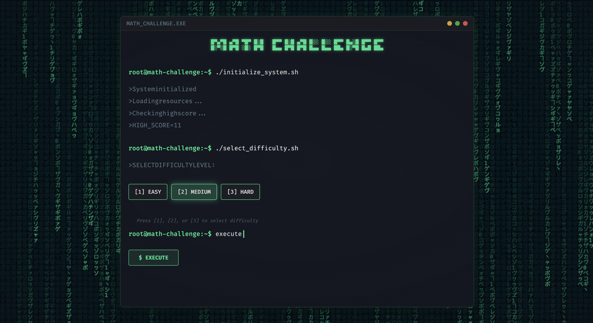
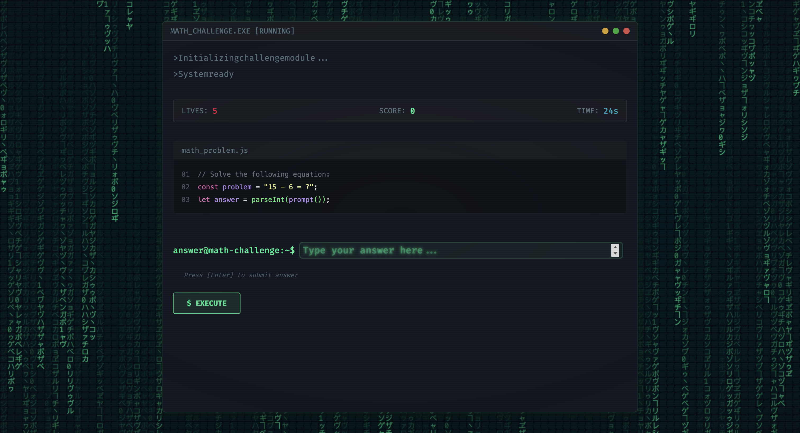

# math_challenge.exe

A retro terminal-style math game.




## Features

- Retro terminal UI with Matrix-inspired background animation
- Three difficulty levels: Easy, Medium, and Hard
- Various math operations: Addition, Subtraction, Multiplication, Division
- Timer system with difficulty-adjusted times
- Lives system with visual feedback
- High score tracking with local storage
- Fully responsive design
- Keyboard shortcuts support

## Tech Stack

- Vanilla JavaScript
- Three.js for background effects
- Vite for bundling and development
- CSS for retro UI styling

## Getting Started

1. Clone the repository
2. Install dependencies:
   ```
   npm install
   ```
3. Run the development server:
   ```
   npm run dev
   ```
4. Build for production:
   ```
   npm run build
   ```
5. Preview the production build:
   ```
   npm run preview
   ```

## How to Play

1. Select a difficulty level (Easy, Medium, Hard)
2. Solve math problems within the time limit
3. Each correct answer increases your score
4. Wrong answers or running out of time decreases lives
5. Game ends when you run out of lives
6. Try to beat your high score!

## License

MIT
